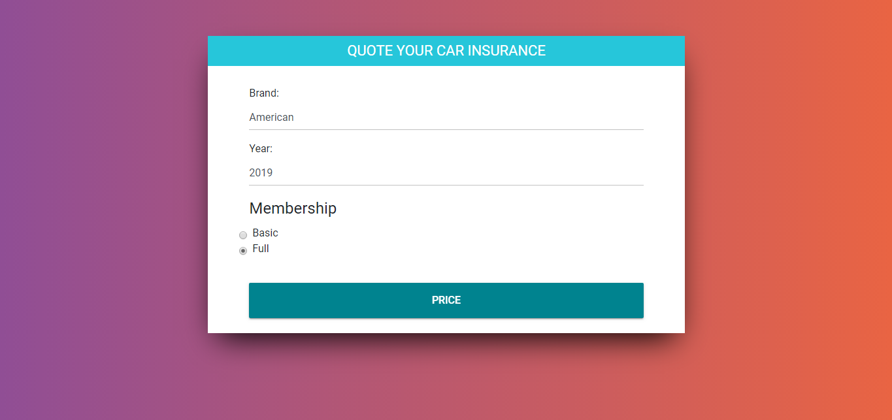
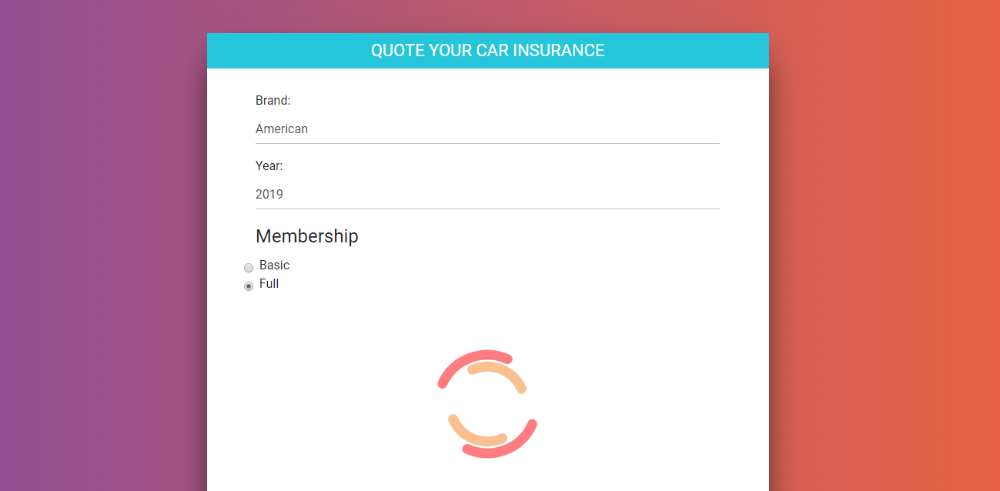
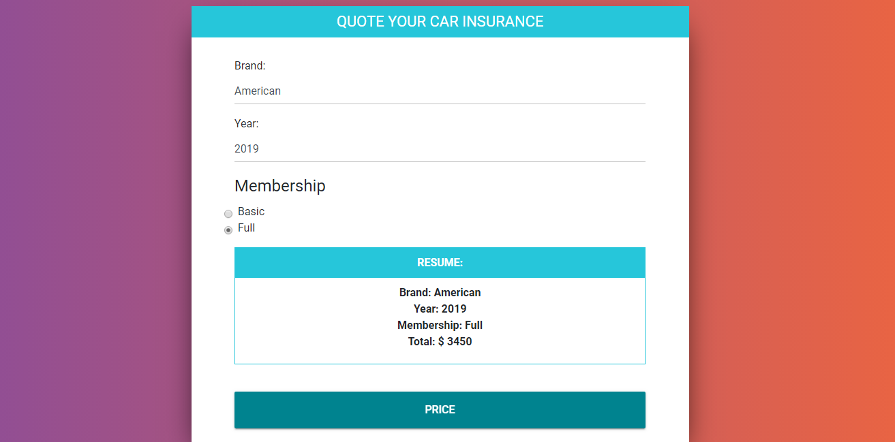

# Car-Insurance-Pure-javascript
In this project we can obtain the membership fee for our car insurance, with parameters already defined by default.
The project was created using Html, Css, Bootstrap and Javascript.

Screenshots:

